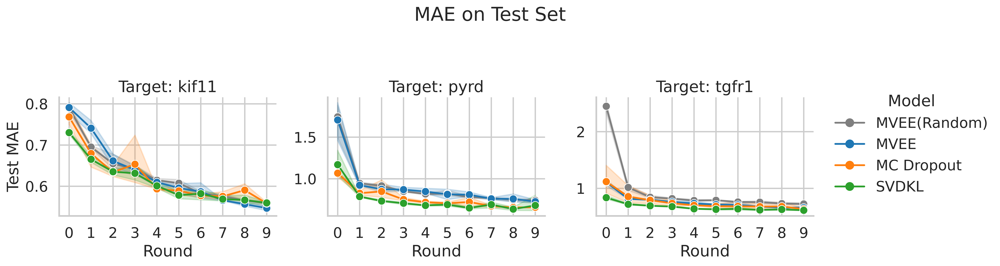
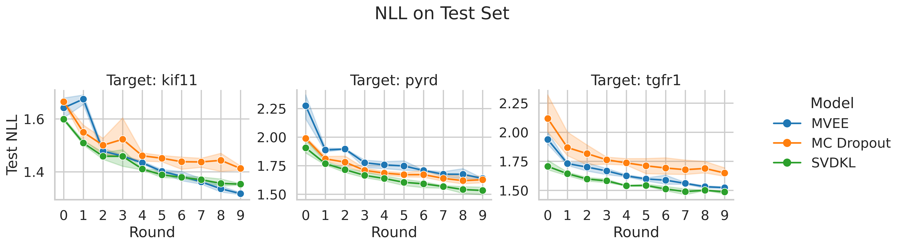
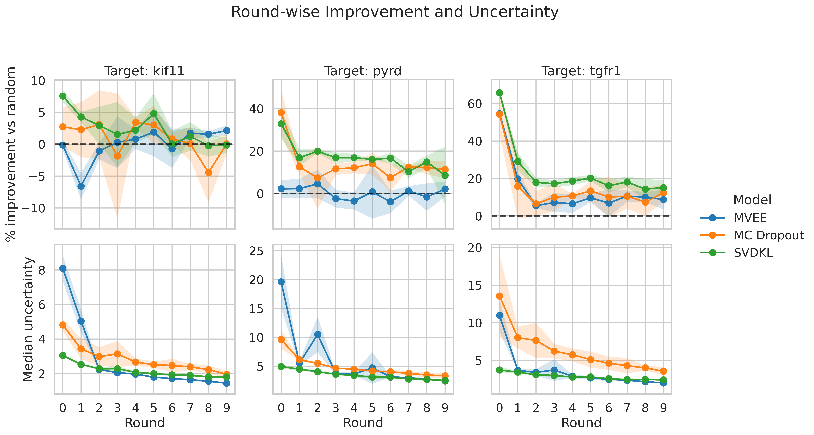
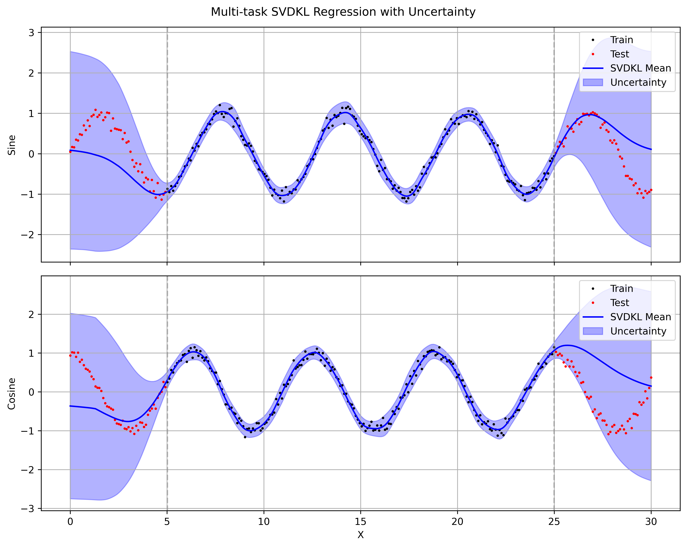
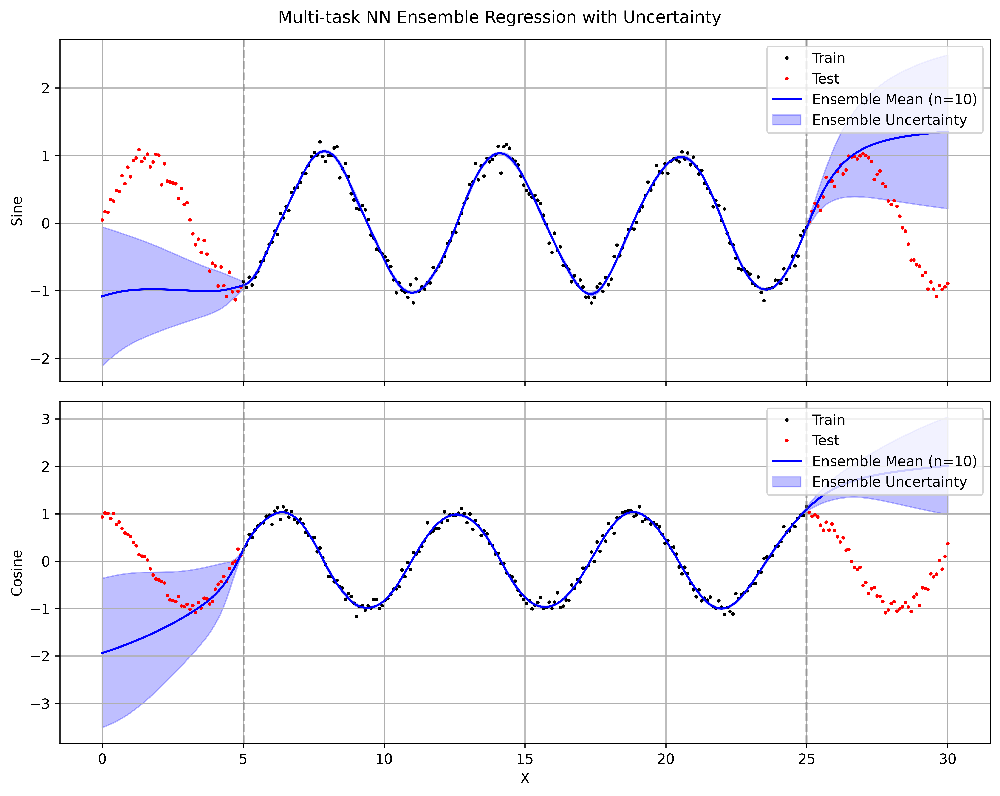

## 1 Introduction

Machine learning models have become indispensable tools in drug discovery, enabling rapid prediction of molecular properties and guiding experimental efforts. There are many different architectures available, each with its own strengths and weaknesses. Among graph neural networks for molecular property prediction, **Chemprop** has emerged as one of the most widely adopted, thanks to its directed message-passing architecture and strong out-of-the-box performance.

A point prediction, however, is only half the story. When a model makes a prediction on a compound, the natural follow-up question is: *how confident is that prediction?* Reliable uncertainty estimates let us prioritise the most informative molecules for expensive follow-up — the core idea behind active learning. Chemprop v2 ships two built-in uncertainty methods (MC Dropout and MVE ensembles). I wanted to benchmark the quality of these methods in a large-scale, iterative active-learning setting. Deep Kernel Learning (DKL) is a powerful framework for uncertainty estimation that combines the representational power of deep neural networks with the principled uncertainty quantification of Gaussian Processes. I implemented a stochastic variational DKL (SVDKL) layer on top of Chemprop's MPNN backbone to see how it compares against the built-in methods.

I am motivated by a simple practical question: how can I effectively quantify the quality of uncertainty estimates in molecular property prediction? In this post I benchmark three uncertainty approaches on top of Chemprop's MPNN backbone:

1. **MC Dropout** — stochastic dropout at inference time, producing a distribution of predictions per molecule.
2. **MVE Ensemble (MVEE)** — an ensemble of independently trained mean-variance estimation heads whose disagreement captures both aleatoric and epistemic uncertainty.
3. **Stochastic Variational Deep Kernel Learning (SVDKL)** [@wilson2016svdkl] — a Gaussian Process placed on the learned neural-network features, yielding a principled posterior variance in a single forward pass.

I evaluate all three within an active-learning loop on docking-score regression data from the **SpaceHASTEN** study [@spacehasten2024], covering three protein targets (TGFR1, KIF11, PYRD) with ~900,000 compounds each. My focus is not just prediction accuracy (MAE), but whether each method's uncertainty is actually informative for guiding decisions.

## 2 Background

### 2.1 Uncertainty in Neural Networks

Any prediction a model makes carries two distinct kinds of uncertainty. **Aleatoric uncertainty** reflects noise inherent in the data itself — measurement error, stochastic assay variability, or the fact that two structurally identical molecules can dock differently depending on the pose sampled. This component does not shrink with more training data; it is a property of the problem. **Epistemic uncertainty**, by contrast, captures what the model does not know: regions of chemical space that are poorly represented in the training set, or regions where the model could fit the data equally well with very different functions. Given enough relevant data, epistemic uncertainty should decrease.

In practice, standard neural networks trained with a single point-estimate loss (e.g. MSE) produce only a best guess and provide no indication of whether that guess is reliable. Worse, modern over-parameterised networks tend to be confidently wrong — their regression outputs can look precise even far from the training distribution. For an active-learning loop, where the whole point is to identify *which molecules the model is least sure about*, this is a serious problem: if uncertainty estimates are uninformative, the acquisition function degenerates into something little better than random selection.

The three methods we compare each address this gap differently. MC Dropout approximates a Bayesian posterior by sampling multiple stochastic forward passes. MVE ensembles train several independent models and read uncertainty off their disagreement. SVDKL replaces the final prediction layer with a Gaussian Process whose kernel operates on learned features, giving a closed-form posterior variance that naturally grows in under-explored regions. The neural network and the GP are trained jointly to maximise the marginal likelihood, which encourages the learned features to be useful for both prediction and uncertainty estimation.

### 2.2 Methods Compared
All three methods are implemented on top of Chemprop's MPNN backbone. I use the same Chemprop hyperparameters for all methods. They share the same training loop, data splits, and acquisition strategy to ensure a fair comparison. The main differences are in how they produce uncertainty estimates, summarised in the table below:

| Method | Mechanism | # Forward Passes | Output |
|--------|-----------|-------------------|--------|
| MC Dropout | Stochastic dropout at inference | $T$ (e.g. 30) | Predictive mean & std from sample distribution |
| MVEE Ensemble | $M$ independently trained MVE heads | $M$ (e.g. 5) | Mixed aleatoric + epistemic from ensemble disagreement |
| SVDKL [@wilson2016svdkl] | Gaussian Process on learned deep kernel features | 1 (+ GP posterior) | Posterior mean & variance from GP |

### 2.3 Data: SpaceHASTEN Docking Scores

To test these methods on a realistic dataset, I used docking scores from the **SpaceHASTEN** study [@spacehasten2024]. SpaceHASTEN docked large libraries of compounds — mined from unenumerated chemical space — against multiple protein targets using physics-based methods, producing continuous docking scores as the regression target.

The study covers three protein targets: **TGFR1**, **KIF11**, and **PYRD**. I obtained roughly 900,000 scored compounds for each target. For tractable active-learning experiments I carved out subsets of 130,000 compounds per target; the splitting strategy is described in §3.

## 3 Experimental Setup

### 3.1 Data Splits

For each target I created 3 non-overlapping subsets of 130,000 compounds to check that results are stable across different slices of the data.

- Each subset is split into: **pool** (100,000), **validation** (10,000), **test** (20,000).
- At round 0, 5000 molecules are drawn at random from the pool to form the initial training set; the remaining 95,000 are available for acquisition.
- The validation set is used for early stopping and uncertainty calibration (Zelikman calibrator, $p = 0.90$).
- The test set is only touched for final evaluation of prediction accuracy and uncertainty quality.

All random draws are seeded for reproducibility. The same splits are used across all three methods to ensure a fair comparison.

### 3.2 Active Learning Loop

- Each experiment runs for **10 rounds**.
- Every round: train the model from scratch on $\mathcal{D}_t$ (no warm-starting from the previous round), predict $(\hat{y}_i, \sigma_i)$ for every pool molecule, acquire $B = 5,000$ new molecules.
- Acquired molecules move from pool to training set: $\mathcal{D}_{t+1} = \mathcal{D}_t \cup \mathcal{A}_t$.
- By the final round the training set has grown from 5,000 to 55,000.
- After each round, raw uncertainties are calibrated on the validation set using Chemprop's `ZelikmanCalibrator` ($p = 0.90$); all metrics are computed on the test set using the calibrated uncertainties.

### 3.3 Uncertainty-Diverse Acquisition with Cluster Diversity

Before the AL loop begins, every pool molecule is assigned to a structural cluster (computed once and cached):

- Compute **Morgan fingerprints** (radius 2, 2048 bits) for all pool molecules.
- Sub-sample up to 100,000 and run RDKit's **MaxMin diversity picker** to select $k = \max(64,\, \min(1024,\, N/100))$ centroids.
- Assign each molecule to its nearest centroid by **Tanimoto similarity**; molecules below a 0.30 similarity threshold get their own singleton cluster.

At acquisition time, the uncertainty-diverse strategy selects molecules as follows:

- **Pre-filter**: keep the top $m = \min(N_{\text{pool}},\; 10B)$ most uncertain candidates.
- **Cluster quotas**: allocate per-cluster quotas proportional to $\sqrt{n_c}$, where $n_c$ is the number of candidates in cluster $c$:

$$
q_c = \left\lfloor B \cdot \frac{\sqrt{n_c}}{\sum_{c'} \sqrt{n_{c'}}} \right\rfloor
$$

  with leftover slots ($B - \sum_c q_c$) assigned one-by-one to the clusters with the largest fractional remainders.

- **Greedy fill**: within each cluster, pick the $q_c$ highest-uncertainty candidates.
- **Overflow**: fill any remaining slots from leftover candidates by uncertainty rank.

## 4 Results

### 4.1 Prediction Accuracy (MAE) Across Rounds



- SVDKL achieves the lowest MAE from the very first round, suggesting that the GP layer helps even with limited data. Since the objective of SVDKL is the marginal likelihood, it may be less prone to overfitting early on.
- MC Dropout and SVDKL are competitive for the active learning task. Both can rank compounds by uncertainty effectively, leading to better acquisition decisions and faster MAE improvement over rounds compared to random selection.
- MVEE struggles to outperform random acquisition for all three targets, suggesting that its uncertainty estimates may be less informative for guiding acquisition. This could be due to overfitting of the MVE heads or insufficient ensemble diversity.

### 4.2 Uncertainty Quality: NLL



- Negative log-likelihood (NLL) captures whether predicted variance matches observed error distribution. Lower NLL indicates better uncertainty calibration where the model's confidence aligns with its accuracy.
- SVDKL consistently achieves the lowest NLL across all targets and rounds, confirming that its GP-based uncertainty is well-calibrated and informative. The SVDKL objective is marginal likelihood, which directly encourages good uncertainty estimates, so this result is expected.
- MC Dropout, generally, has worse NLL than both SVDKL and MVEE. This suggests that while MC Dropout uncertainty was useful in ranking compounds for acquisition, it is still over-confident in its predictions.

### 4.3 Uncertainty Improvement Over Rounds



- I tracked the median uncertainty of the acquired molecules at each round in bottom row. All models show a decrease in uncertainty over rounds, which is expected as the training set grows and the model becomes more confident.
- However, a drop in uncertainty alone does not guarantee better acquisition: SVDKL and MC Dropout translate this into real improvement over random, whereas MVEE often does not as shown in top row.
- Generally, MC Dropout has higher variation across subsets during the early rounds. In the low-data regime, the stochasticity of MC Dropout can lead to more variable uncertainty estimates, which may explain the wider spread in performance across subsets.
- For PYRD and TGFR1, SVDKL shows the largest improvement over random acquisition, especially in the early rounds. The gain drops after the first few rounds, but remains consistently positive, suggesting that its uncertainty estimates are useful for selecting informative molecules.
- MC Dropout also improves over random acquisition, but the effect is smaller and less stable than for SVDKL. It is competitive on PYRD, but clearly weaker on TGFR1. On KIF11, the differences between methods are smaller and noisier. SVDKL still has the strongest early improvement, but the advantage narrows as the rounds progress.

With these trends established, I'll now look under the hood at how SVDKL actually works.

## 5 SVDKL Deep Dive: 1D Toy Example

To make the SVDKL design concrete, I built a small 1D sine-wave experiment in `svdkl/test_1d.ipynb`. The model has three conceptual pieces: a GP layer with a variational approximation, a mixing likelihood that maps latent GP outputs to the task space, and a neural backbone that feeds the GP.

Starting with the GP layer, in this setup I use an `ApproximateGP` with a `CholeskyVariationalDistribution`, wrapped in `GridInterpolationVariationalStrategy` and then `IndependentMultitaskVariationalStrategy`. This gives a scalable variational GP that still supports multiple latent GP dimensions.

```python
class GaussianProcessLayer(gpytorch.models.ApproximateGP):
  """Independent 1D GPs with grid interpolation for SVDKL."""

  def __init__(
    self,
    num_dim: int,
    grid_bounds: Tuple[float, float] = (-10.0, 10.0),
    grid_size: int = 64,
  ) -> None:
    variational_distribution = gpytorch.variational.CholeskyVariationalDistribution(
      num_inducing_points=grid_size,
      batch_shape=torch.Size([num_dim]),
    )
    variational_strategy = gpytorch.variational.IndependentMultitaskVariationalStrategy(
      gpytorch.variational.GridInterpolationVariationalStrategy(
        self,
        grid_size=grid_size,
        grid_bounds=[grid_bounds],
        variational_distribution=variational_distribution,
      ),
      num_tasks=num_dim,
    )
    super().__init__(variational_strategy)

    self.covar_module = gpytorch.kernels.RBFKernel()
    self.mean_module = gpytorch.means.ConstantMean()
    self.grid_bounds = grid_bounds

  def forward(self, x: torch.Tensor) -> gpytorch.distributions.MultivariateNormal:
    mean = self.mean_module(x)
    covar = self.covar_module(x)
    return gpytorch.distributions.MultivariateNormal(mean, covar)
```

The second piece is the mixing likelihood. The GP layer outputs `num_dim` latent functions, but my regression task can have a different output dimensionality (`num_tasks`). The mixing matrix learns how to project latent GP samples into task space before applying Gaussian observation noise.

```python
class MixingLikelihood(gpytorch.likelihoods.Likelihood):
  """Projects num_dim latent GP samples to num_tasks outputs."""

  def __init__(self, num_dim: int, num_tasks: int) -> None:
    super().__init__()
    self.num_dim = num_dim
    self.num_tasks = num_tasks
    self.mixing_weights = torch.nn.Parameter(torch.randn(num_dim, num_tasks) / num_dim)
    self.base_likelihood = gpytorch.likelihoods.MultitaskGaussianLikelihood(num_tasks=num_tasks)

  def forward(self, function_samples: torch.Tensor, **kwargs) -> gpytorch.distributions.MultitaskMultivariateNormal:
    loc = function_samples @ self.mixing_weights  # [..., N, num_tasks]
    return self.base_likelihood(loc, **kwargs)
```

Finally, I combine everything into the full SVDKL model. A simple MLP maps raw inputs to a feature space, features are scaled into GP grid bounds, and the GP layer produces a posterior over latent functions. This is the exact pattern I later adapted for molecular features in the full Chemprop pipeline.

```python
class MLP(gpytorch.Module):
  """Simple MLP backbone for SVDKL."""

  def __init__(self, input_dim: int, hidden_dim: int, output_dim: int) -> None:
    super().__init__()
    self.net = torch.nn.Sequential(
      torch.nn.Linear(input_dim, hidden_dim),
      torch.nn.ReLU(),
      torch.nn.Linear(hidden_dim, output_dim),
    )

  def forward(self, x: torch.Tensor) -> torch.Tensor:
    return self.net(x)


class SVDKLModel(gpytorch.Module):
  """SVDKL model combining an MLP backbone, GP layer, and mixing likelihood."""

  def __init__(
    self,
    input_dim: int,
    hidden_dim: int,
    gp_dim: int,
    num_tasks: int = 1,
    grid_bounds: Tuple[float, float] = (-10.0, 10.0),
    grid_size: int = 128,
  ) -> None:
    super().__init__()
    self.backbone = MLP(input_dim, hidden_dim, gp_dim)
    self.gp_layer = GaussianProcessLayer(gp_dim, grid_bounds, grid_size)
    self.likelihood = MixingLikelihood(gp_dim, num_tasks)
    self.scale_to_bounds = gpytorch.utils.grid.ScaleToBounds(grid_bounds[0], grid_bounds[1])

  def forward(self, x: torch.Tensor) -> gpytorch.distributions.MultitaskMultivariateNormal:
    features = self.backbone(x)
    scaled = self.scale_to_bounds(features)
    scaled = scaled.transpose(-1, -2).unsqueeze(-1)
    gp_output = self.gp_layer(scaled)
    return gp_output
```




I use a RBF kernel for the GP layer, which gives smooth function draws and a posterior variance that grows away from training points. The SVDKL model captures the aleatoric noise in the data (the sine wave has Gaussian noise added) while also giving a sensible epistemic uncertainty that grows in regions with no training data. Replacing the RBF kernel with a Periodic kernel would give better extrapolation to the true sine wave, but I wanted to keep the kernel simple to demonstrate the general SVDKL pattern: learn features with a neural network, then place a flexible GP on top to get principled uncertainty estimates.


For comparison I also ran a simple ensemble of 10 independently initialized three-layer MLPs (two hidden Tanh layers). Uncertainty here is obtained as the standard deviation across the 10 sets of predictions.



The ensemble models overfit on the training data with almost no variance in the predictions. The uncertainty on the test data is also poorly calibrated, with the ensemble mean and variance failing to capture the true data distribution. Tanh nonlinearities are essential for this data — ReLU fails to fit the training data at all. Even with the right nonlinearity, the ensemble's mean and variance extrapolate poorly outside the training region, giving overconfident predictions far from the training points. In contrast, SVDKL's GP layer naturally gives uncertainty that covers the true function.

## 6 Discussion & Conclusions

The results point to a few fairly actionable conclusions:

- **SVDKL** provides the best-calibrated uncertainties (lowest NLL and strong active learning performance) but is more expensive to train (GP layer overhead, grid-size tuning).
- **MC Dropout** is cheapest but uncertainty quality is lower. It can still be useful but is more prone to over-confidence.
- **MVE Ensembles** are more expensive than MC Dropout and did not show a clear advantage in this setting. In principle, deep ensembles are strong. In practice here, MVEE didn't consistently translate uncertainty into better acquisition decisions, and the random-vs-uncertainty-diverse gap was smaller than I expected. I suspect that 5 ensemble members may not provide enough diversity at 100k-compound scale, and the MVE variance heads may be collapsing to similar estimates — but I didn't investigate this further.

### 6.1 Cost and Complexity Trade-offs

These three methods sit at very different points on the cost–quality curve, and which one makes sense depends on your constraints:

- **Training cost**: MC Dropout trains a single model with dropout enabled — the cheapest option by far. MVEE multiplies that cost by the ensemble size (5× in our experiments). SVDKL trains one model but adds a GP layer with its own set of hyperparameters (grid size, GP learning rate, inducing structure), which makes tuning more involved.
- **Inference cost**: This is where SVDKL has a surprising advantage. It needs only one forward pass plus a GP posterior computation, whereas both MC Dropout and MVEE require multiple forward passes ($T = 30$ and $M = 5$ respectively). When scoring large pools of hundreds of thousands of compounds every AL round, inference throughput matters — and SVDKL scales better here.
- **Engineering effort**: MC Dropout is essentially "flip a flag." MVEE requires managing multiple model instances and aggregating their outputs. SVDKL brings in GPyTorch machinery — grid scaling, Cholesky numerics, variational distributions — that demands more careful implementation and debugging. The payoff is in calibration quality, but the integration cost is non-trivial.

## 7 Reproducibility

Key dependencies:

- [`chemprop>=2.0`](https://github.com/chemprop/chemprop) — message-passing neural networks with built-in MC Dropout and MVE uncertainty.
- [`gpytorch>=1.11`](https://github.com/cornellius-gp/gpytorch) — scalable Gaussian processes for the SVDKL layer.
- [`lightning>=2.0`](https://github.com/Lightning-AI/pytorch-lightning) — training loop and checkpointing.

Core code is available as a [GitHub Gist](https://gist.github.com/sponde25/1851362bd1449b5236690277769309b1):

- [`models.py`](https://gist.github.com/sponde25/1851362bd1449b5236690277769309b1#file-models-py) — model wrappers for MC Dropout, MVEE, and SVDKL (including `SVDKLLightningModule`).
- [`acquisition.py`](https://gist.github.com/sponde25/1851362bd1449b5236690277769309b1#file-acquisition-py) — clustering and uncertainty-diverse acquisition function.
- [`toy_example.ipynb`](https://gist.github.com/sponde25/1851362bd1449b5236690277769309b1#file-toy_example-ipynb) — 1D sine-wave toy example demonstrating SVDKL posterior behaviour.

## References

::: {#refs}
:::

